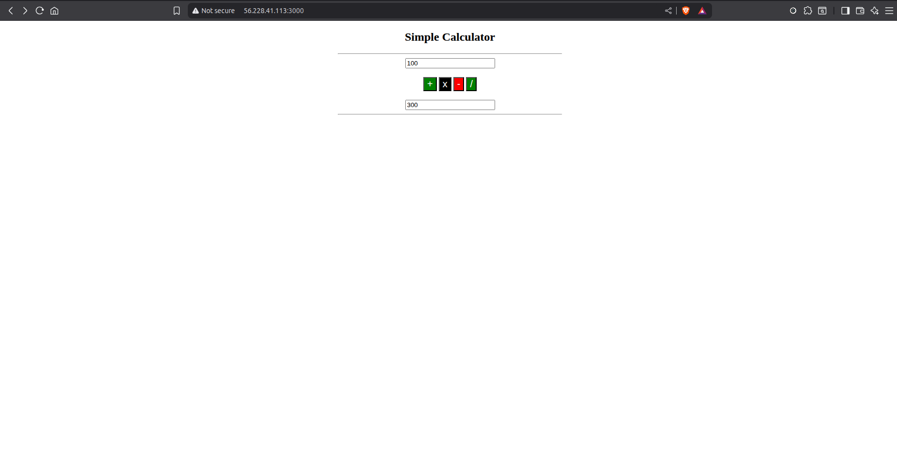
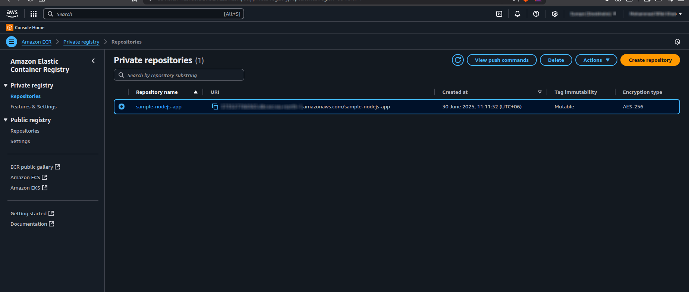
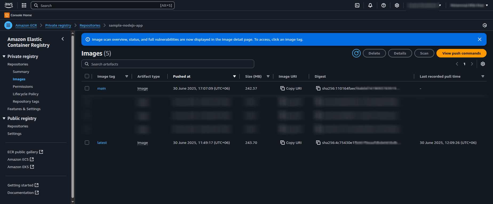
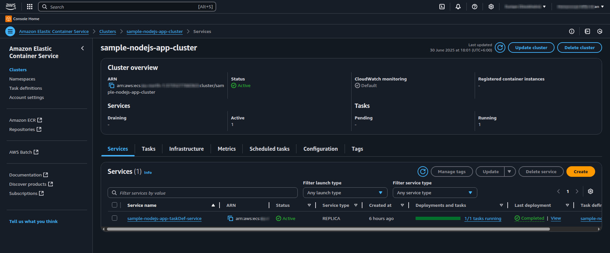
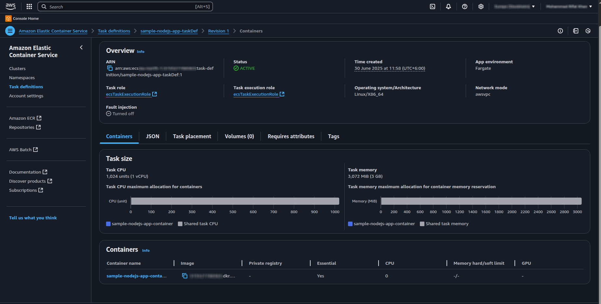
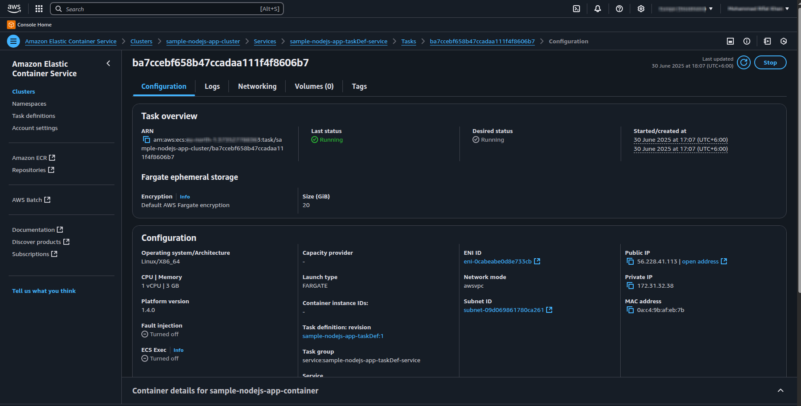
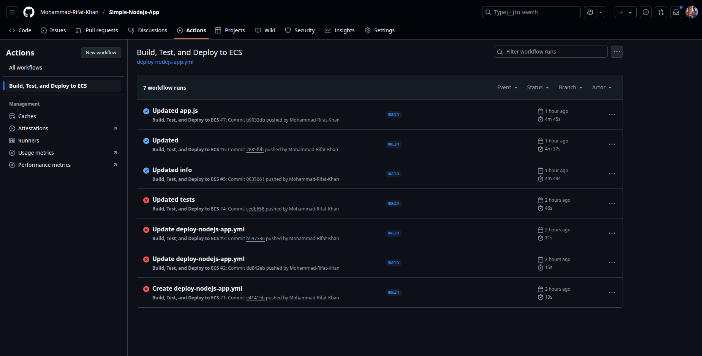
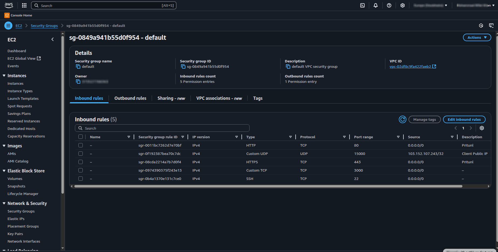
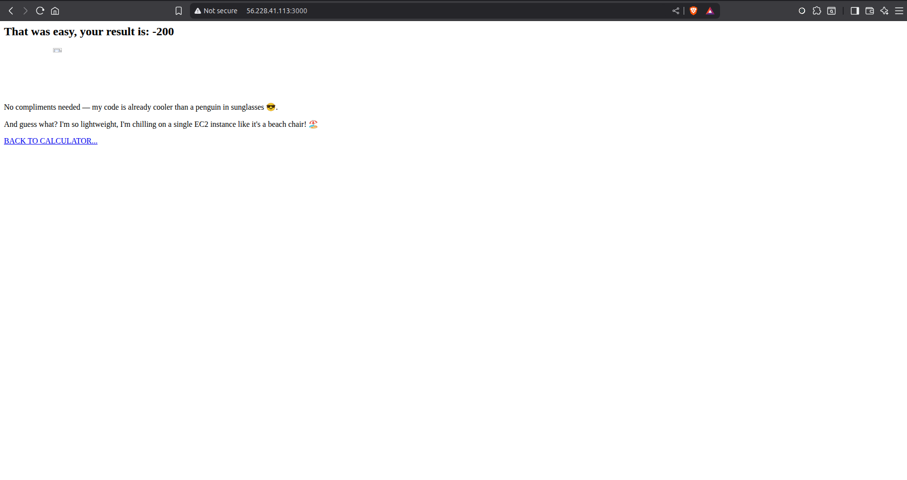
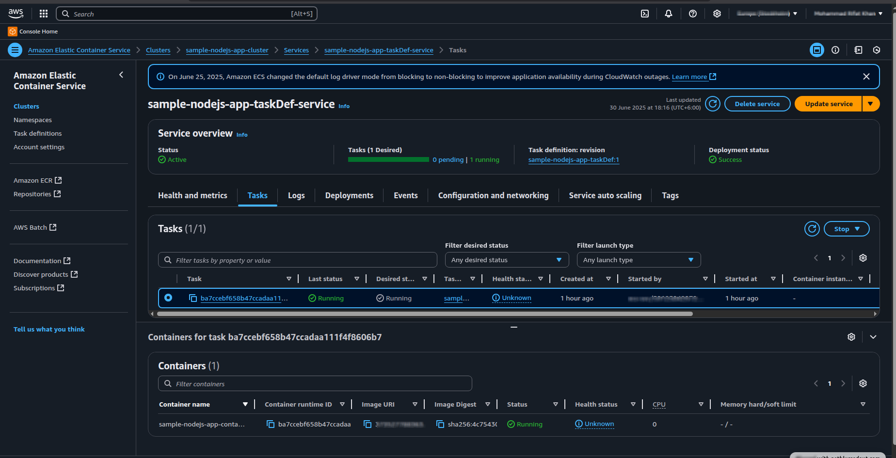

# Simple Node.js Calculator App on AWS ECS Fargate

> **Project adapted and extended from [aws-samples/amazon-ecs-demo-with-node-express](https://github.com/aws-samples/amazon-ecs-demo-with-node-express)**  
> This guide details my end-to-end experience building, containerizing, and deploying a Node.js calculator web app using AWS ECS **Fargate** and CI/CD with GitHub Actions—including troubleshooting tips to help others.

---



---

## Table of Contents

- [Project Overview](#project-overview)
- [Step 1: Clone and Explore the App](#step-1-clone-and-explore-the-app)
- [Step 2: Dockerize the Application](#step-2-dockerize-the-application)
- [Step 3: Push Image to Amazon ECR](#step-3-push-image-to-amazon-ecr)
- [Step 4: Deploy on AWS ECS (Fargate)](#step-4-deploy-on-aws-ecs-fargate)
- [Step 5: Set Up CI/CD with GitHub Actions](#step-5-set-up-cicd-with-github-actions)
- [Step 6: Troubleshooting – Security Groups and Service Visibility](#step-6-troubleshooting--security-groups-and-service-visibility)
- [Architecture](#architecture)
- [Screenshots](#screenshots)
- [Tech Stack](#tech-stack)
- [License & Credits](#license--credits)

---

## Project Overview

This is a Node.js + Express web calculator app, fully containerized with Docker and deployed using AWS ECS **Fargate**. The project uses a robust CI/CD pipeline via GitHub Actions to automatically build, test, and deploy to the cloud.

---

## Step 1: Clone and Explore the App

I started with the [aws-samples/amazon-ecs-demo-with-node-express](https://github.com/aws-samples/amazon-ecs-demo-with-node-express) repository, which provides a simple Node.js/Express application and a `Dockerfile`.

```bash
git clone https://github.com/aws-samples/amazon-ecs-demo-with-node-express.git
cd amazon-ecs-demo-with-node-express/sample-nodejs-app
# Explore app.js, package.json, and Dockerfile
```

---

## Step 2: Dockerize the Application

The sample already included a `Dockerfile`. If starting from scratch, you would:

```dockerfile
FROM node:18
WORKDIR /usr/src/app
COPY package*.json ./
RUN npm install
COPY . .
EXPOSE 3000
CMD [ "node", "app.js" ]
```

Build and test the container locally:

```bash
docker build -t simple-nodejs-app .
docker run -p 3000:3000 simple-nodejs-app
# Visit http://localhost:3000 to verify
```

---

## Step 3: Push Image to Amazon ECR

### 1. **Create an ECR Repository**

```bash
aws ecr create-repository --repository-name simple-nodejs-app
```

### 2. **Authenticate Docker to ECR**

```bash
aws ecr get-login-password --region <region> | docker login --username AWS --password-stdin <aws_account_id>.dkr.ecr.<region>.amazonaws.com
```

### 3. **Tag and Push the Image**

```bash
docker tag simple-nodejs-app:latest <aws_account_id>.dkr.ecr.<region>.amazonaws.com/simple-nodejs-app:latest
docker push <aws_account_id>.dkr.ecr.<region>.amazonaws.com/simple-nodejs-app:latest
```

**ECR Repository and Image Push Screenshots:**  
Below are screenshots showing my ECR repository after tagging and pushing the image:


> _**Note:** This image demonstrates that your ECR repository exists and is ready for image push._


> _**Note:** This image demonstrates your Docker image has been successfully pushed and is available for ECS deployment._

---

## Step 4: Deploy on AWS ECS (Fargate)

### 1. **Task Definition (Fargate)**

In the ECS Console:
- **Launch type:** Fargate
- **Task Definition Name:** sample-nodejs-app
- **Container name:** sample-nodejs-app
- **Image URI:** `<your_ecr_repo_uri>:latest`
- **Container Port:** 3000

> **Important Note on Port Mapping in ECS Fargate:**  
> As of the latest AWS ECS Console update, the option to set a **host port** is no longer available for Fargate services.  
> When defining your task definition, you only need to specify the **container port** (such as `3000`).  
> Fargate will automatically manage host-side networking for you.  
> If you reference older guides or see references to host port mapping, please adapt those steps to use only the container port in your configuration.

### 2. **Create an ECS Cluster**

- **Cluster Template:** Networking only (Fargate)
- **Cluster Name:** sample-nodejs-app-cluster

### 3. **Create Service**

- **Launch type:** Fargate
- **Service Name:** sample-nodejs-app-service
- **Number of tasks:** 1
- **Network:** Choose VPC/subnets. Make sure at least one subnet is public.
- **Security Group:** See next step for important notes!
- **Assign Public IP:** ENABLED (for public access)

>   
>   
> 

---

## Step 5: Set Up CI/CD with GitHub Actions

My workflow automatically:
- Builds and pushes the Docker image to ECR on each push to `main`/`master`
- Updates the ECS Fargate service with the new image

**Key secrets to add in GitHub repository:**
- `AWS_ACCESS_KEY_ID`, `AWS_SECRET_ACCESS_KEY`, `AWS_REGION`
- `ECR_REGISTRY`, `ECR_REPOSITORY`

**Sample workflow file:**  
_Save as `.github/workflows/deploy.yml`_

```yaml
name: Deploy Node.js Calculator to ECS Fargate

on:
  push:
    branches: [main, master]

jobs:
  deploy:
    runs-on: ubuntu-latest
    steps:
      - uses: actions/checkout@v4
      - uses: aws-actions/configure-aws-credentials@v4
        with:
          aws-access-key-id: ${{ secrets.AWS_ACCESS_KEY_ID }}
          aws-secret-access-key: ${{ secrets.AWS_SECRET_ACCESS_KEY }}
          aws-region: ${{ secrets.AWS_REGION }}
      - name: Log in to Amazon ECR
        id: login-ecr
        uses: aws-actions/amazon-ecr-login@v2
      - name: Build, tag, and push image
        run: |
          docker build -t ${{ secrets.ECR_REPOSITORY }} .
          docker tag ${{ secrets.ECR_REPOSITORY }}:latest ${{ secrets.ECR_REGISTRY }}/${{ secrets.ECR_REPOSITORY }}:latest
          docker push ${{ secrets.ECR_REGISTRY }}/${{ secrets.ECR_REPOSITORY }}:latest
      - name: Deploy to ECS
        uses: aws-actions/amazon-ecs-deploy-task-definition@v1
        with:
          task-definition: ecs-task-def.json
          service: sample-nodejs-app-service
          cluster: sample-nodejs-app-cluster
```

_Edit task/service/cluster names as needed._

>   
> _**Note:** This helps show that CI/CD is working as intended._

---

## Step 6: Troubleshooting – Security Groups and Service Visibility

**Common Issue:**  
After deploying, I couldn’t access the web app from my browser.

**Root Cause:**  
I used the default security group, which blocks inbound HTTP traffic.

**Solution:**  
- Go to the ECS service’s ENI (Elastic Network Interface) security group.
- Edit inbound rules to **allow TCP traffic on port 3000** (or 80) from `0.0.0.0/0` (for public access).
- Save changes.
- Visit the Public IP or Load Balancer DNS again — the app should now be visible!

>   

---

## Architecture


> _**Note:**full cloud workflow: GitHub → ECR → ECS (Fargate) → User._

---

## Screenshots

- **Calculator UI:**  
  
  
- **ECS Service Details:**  
  

> _**Note:** Add clear screenshots of your running app, ECS service, and any other relevant UI pages._

---

## Tech Stack

- **Frontend:** HTML/CSS
- **Backend:** Node.js (Express)
- **Containerization:** Docker
- **CI/CD:** GitHub Actions
- **Cloud:** AWS ECS (Fargate), ECR

---

## License & Credits

- **MIT License** – see [LICENSE](LICENSE)
- **Original Source & Inspiration:**  
  [aws-samples/amazon-ecs-demo-with-node-express](https://github.com/aws-samples/amazon-ecs-demo-with-node-express)

---

**Feel free to fork, adapt, and extend this guide.**  
If you run into issues, check the [Troubleshooting](#step-6-troubleshooting--security-groups-and-service-visibility) section and refer to official AWS docs for more details!
